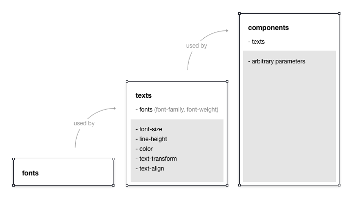

# Guide: Basic

:warning: Make sure you finished the guide [getting started guide](./guides-getting-started.md)

## 1. Create Text Styles

Text Styles represent bundles of text-related styling such as `font-family`, `line-height` etc. As such they are on a different level of abstraction than both components and fonts.

It may be useful to think of Text Styles as CSS classes specialized and constrained to text-specific properties.



  ```js
  // in config.js
  export default {
    texts: {
      name: 'Text Styles',
      tokens: [
        {
          name: 'huge', // Defines the name of the Text Style
          value: {
            fontFamily: 'HelveticaNeue-Bold', // Enter PostScript-Name
            fontSize: 90, // CSS styling
            lineHeight: 90, // CSS styling
            textAlign: 'center' // CSS styling
          }
        }
      ]
    }
  };
  ```

  

## 2. Make your Text Styles a bit smarter

If you followed along the [Getting started](./guides-getting-started.md) guide you may have noticed that the Text Style CSS styling print information that is already contained in lower level tokens, such as `fonts`. In order to hide this information you can use **named values** like this:

```js
export default {
  texts: {
    name: 'Text Styles',
    tokens: [
      {
        name: 'huge',
        value: {
          fontFamily: { // 'named values' example
            name: 'HNB', // Defines the name of the 'named value'
            value: 'HelveticaNeue-Bold' // Define the actual value of the 'named value'
          }
        }
      }
    ]
  }
};
```

This is especially useful to emphasize the relationship between different tokens without coupling them explicitly:

```js
export default {
  fonts: {
    name: 'Fonts',
    tokens: [
      {
        name: 'HNB', // Consistant naming
        description: `
          Helvetica Neue
          Bold
        `,
        value: 'HelveticaNeue-Bold'
      }
    ]
  },
  texts: {
    name: 'Text Styles',
    tokens: [
      {
        name: 'huge',
        value: {
          fontFamily: {
            name: 'HNB', // Consistant naming
            value: 'HelveticaNeue-Bold'
          },
          fontSize: 60
        }
      }
    ]
  }
};
```

As `config.js` contains JavaScript you can couple the tokens explicitly for greater consistency:

```js
const HNB = { // Define a variable you want to use in more than one token
  name: 'HNB',
  value: 'HelveticaNeue-Bold'
};

export default {
  fonts: {
    name: 'Fonts',
    tokens: [
      {
        name: HNB.name, // refer to variable
        value: HNB.value, // refer to variable
        description: `
          Helvetica Neue
          Bold
        `
      }
    ]
  },
  texts: {
    name: 'Text Styles',
    tokens: [
      {
        name: 'huge',
        value: {
          fontFamily: HNB, // refer to variable
          fontSize: 60
        }
      }
    ]
  }
};
```
